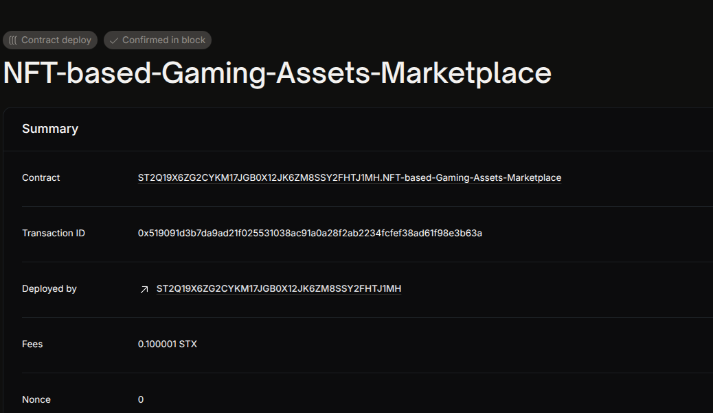

# Project Title
NFT-based Gaming Assets Marketplace

## Project Description
This smart contract allows minting and transferring unique gaming asset NFTs on the blockchain, providing a decentralized marketplace for players to own, trade, and manage their in-game items securely.

## Project Vision
To empower gamers by giving true ownership of their digital assets on-chain and fostering a transparent, trustless marketplace where assets can be securely bought, sold, and transferred.

## Future Scope
- Integrate with marketplace listings and auctions
- Add metadata support (e.g., asset attributes, rarity)
- Implement royalty payments to original creators
- Enable cross-game asset interoperability

## Contract Address
ST2Q19X6ZG2CYKM17JGB0X12JK6ZM8SSY2FHTJ1MH.NFT-based-Gaming-Assets-Marketplace
